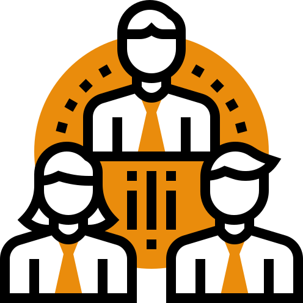
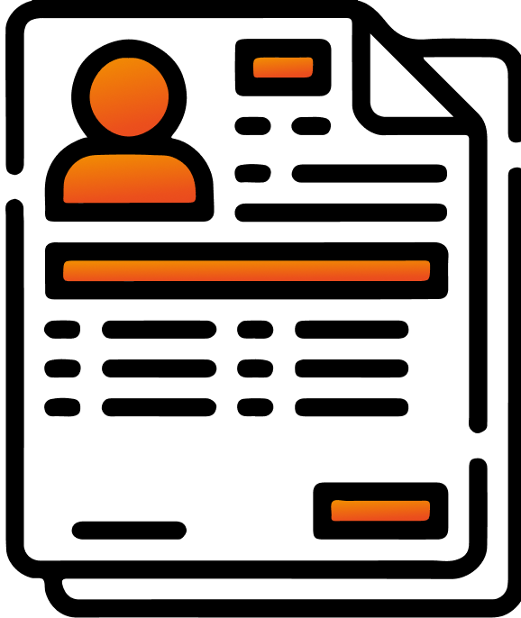

# **Sistema QuarkRH** - :fontawesome-solid-book: **Documentação**

##   **Visão Geral**

O **QuarkRH** é um sistema web, que foi desenvolvido para oferecer uma gestão completa e integrada de recursos humanos, organizado de forma modular para facilitar a navegação, manutenção e expansão das funcionalidades. Cada módulo é responsável por um conjunto específico de operações, permitindo que sua empresa gerencie de forma eficiente os seus processos internos, além de interações com seus colaboradores. O sistema possui módulos como **departamento pessoal, benefícios, frequência, férias, saúde ocupacional, gestão de epi, avaliação de desempenho, comunicação, recrutamento e seleção**, entre outros.

##   **Departamento Pessoal**

No módulo de **DP** vamos poder realizar atividades como:

- Cadastro e gestão de colaboradores
- Envio e controle de documentos para assinatura
- Cadastro de dependentes dos colaboradores
- Geração da folha de pagamento
- Configurações gerais da empresa (dados cadastrais, cargos, setores, salários etc.)
- Criar solicitações e manter os registros e controles
- Controle de cheklist admissonal e demissional
- Relatórios de aniversariantes, salários, indice de rotatividades

##  **Frequência**

No módulo **Frequência**  vamos poder realizar atividades como:

- Configurações de horários, jornadas e escalas
- Associar as jornadas/escalas para os colaboradores
- Relatórios de registros de pontos
- Relatórios de localizações
- Relatórios de jornadas
- Configurar banco de horas
- Configurar cerca virtual
- Configurar a aprovar solicitações de pontos e/ou atestados
- Realizar abonos, e alterações/ajustes de horários e jornadas

##  **Férias**

No módulo **Férias** vamos poder realizar atividades como:

- Definir as configurações de férias
- Cadastrar as férias dos colaboradores
- Acompanhar o cronograma de férias da empresa
- Relatórios de férias a vencer
- Relatório de Férias por setor
- Relatório de Férias por mês
- Relatório de Férias por situação
- Período aquisitivo de cada colaborador

##  **Benefícios**
No módulo de **Benefícios** vamos poder realizar atividades como:

- Criar benefício de Plano de saúde
- Criar benefício de Plano odontológico
- Criar benefício de Auxílio alimentação
- Criar benefício de Auxílio refeição
- Criar benefício de Auxílio transporte
- Consultar relatórios de benefícios

##  **Saúde Ocupacional**

No módulo de **Saúde Ocupacional**, vamos poder realizar atividades como:

- Controle de Asos
- Controle de atestados
- Relatório de atestados cadastrado, podendo consultar por médico, por colaborador
- Tratativas de denuncias

##  **Gestão de EPI**

No módulo de **Gestão de EPI** vamos poder realizar atividades como:

- Criar estoque por produto
- Cadastrar compras de novos itens
- Registrar entregas de EPIS
- Registrr Devolução de EPI
- Relatório de EPI em uso
- Relatório de estoque 
- Relatório de entradas e saídas

##  **Pesquisa de Clima**

No módulo de **Pesquisa de Clima** vamos poder realizar atividades como criar pesquisas para que os colaboradores realize as respostas pelo portal do colaborador e o DP/RH consiga acompanhar essas respostas acessando pelo menu de resultados.

##  **Recrutamento e Seleção**

No módulo de **Recrutamento e seleção** vamos poder realizar atividades como:

- Criar cada etapa do processo seletivo
- Criar as situações para cada candidato
- Criar questionários e permitir que o candidato se inscreva já no momento da sua inscrição
- Criar processo seletivo individuais, podendo configurar um processo para cada cargo necessário
- Aplicar o teste Disc
- Ter um site exclusivo onde divulgar essas vagas
- Ter um banco de currículos
- Solciitar que candidatos aprovados enviem seus documentos pela própria plataforma

##  **Comunicação**

No módulo **Comunicaçao** vamos poder realizar atividades como:

- Criar comunicados para exibir no portal do colaborador
- Criar comunicados para enviar por e-mail
- Cria uma pesquisa
- Criar e configurar um FAQ para disponibilizar no portal do colaborador

##  **Avaliação de Desempenho**

No módulo **Avaliação de Desempenho** vamos poder realizar atividades como:

- Configurar a avaliação
- Analisar estatísticas de execução por avaliação
- Criar avaliações por cargos
- Configurar matriz ninebox

##  **Perfil Comportamental**

No módulo de **Perfil Comportamental** vamos poder habilitar a opção do teste disc para os colaboradores da nossa empresa e acompanhar os seus resultados

##  **Feedbacks**

No módulo **Feedbacks** vamos poder realizar atividades como:

- Definir configurações para elogíos
- Permitir feedbacks entre colaboradores
- Permitir feedbacks entre unidades
- Analisar relatórios de elogios
- Aprovar elogios

##  **Portal do Gestor**

No módulo **Portal do Gestor** vamos poder realizar atividades como:

- Analisar e aprovar solicitações de frequência e férias do setor no qual sou o gestor
- Registrar feedbacks dos meus liderados
- Registrar avaliação de desempenho dos meus liderados
- Registrar avaliação de experiência dos meus liderados
- Analisar relatório de frequência dos meus liderados
- Analisar relatórios de férias dos meus liderados

##  **Portal do Colabordor**

No módulo **Portal do Colaborador** vamos poder realizar atividades como:

- Realizar registro de ponto
- Cadastar solicitação de frequência
- Cadastrar solicitação de férias
- Cadastrar elogios aos meus colegas de trabalho 
- Analisar meu banco de horas
- Analisar meu registro de frequência
- Analisar os aniversariantes da semana
- Acessar o FAQ do sistema, tirar minhas dúvidas e enviar sugestões ao DP/RH
- Acessar o mural de elogios e acompanhar os elogios registrados
- Acompanhar a programação das minhas férias 
- Acompanhar os feedbacks que recebi
- Realizar um feedback para outro colaborador
- Registrar uma denúncia através do canal de denúncia
- Realizar o teste disc

##  **Treinamento e Desenvolvimento**

No módulo de **Treinamento e Desenvolvimento** vamos poder realizar atividades como:

- Criar cursos e disponibilizar para dos colaboradores realizar pela plataforma
- Configurar cada curso classificando por categoria
- Configurar cada curso por módulos ou por aulas
- Configurar um questíonário para cada módulo
- Definir uma pontuação para poder concluir o curso de forma efetiva
- Emitir um certificado do curso
- Configurar trilhas para facilitar o aprendizado do colaborador
